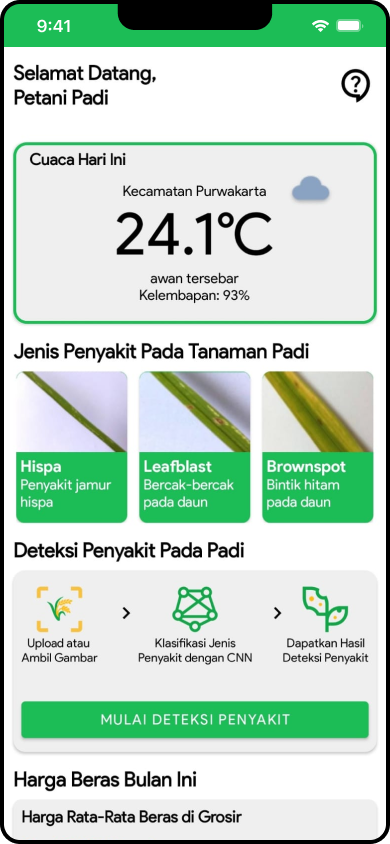
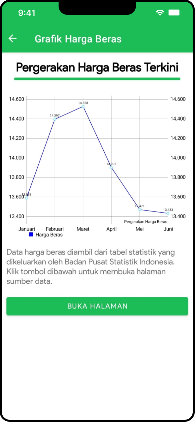

  

<h1 align="center">
   PadiBagus:  Disease detection on rice leaves using TensorFlow Lite model 
</h1>
<h3>
   1. Overview
</h3>
PadiBagus is an application developed with the goal of enhancing rice farmers' productivity. This application is the result of implementing research titled "Classification of Rice Plant Diseases Using Rice Leaf Images with MobileNetv3 Large Convolutional Neural Network Architecture." This research is based on the decline in rice production and harvested rice field areas in Indonesia from 2021 to 2023. It is hoped that this application will contribute to an increase in rice production and harvested rice field areas in the future.

<h3>
   2. Dataset
</h3>
The dataset used in this study is sourced from Kaggle.com and can be accessed via (https://www.kaggle.com/datasets/baguskusuma/rice-leaf-disease). The sample of dataset is illustrated in the figure below

  

<h3>
   3. Model
</h3>
The model developed on this dataset employs the MobileNetV3 Large architecture, achieving an accuracy of 80%. The model architecture is illustrated in the figure below.

  

<h3>
   3. App
</h3>

  

  
  
  
    

  

  
  
    

> **MIT License**
> 
> Copyright (c) 2024 PadiBagus
> 
> Permission is hereby granted, free of charge, to any person obtaining a copy of this software and associated documentation files (the "Software"), to deal in the Software without restriction, including without limitation the rights to use, copy, modify, merge, publish, distribute, sublicense, and/or sell copies of the Software, and to permit persons to whom the Software is furnished to do so, subject to the following conditions:
> 
> The above copyright notice and this permission notice shall be included in all copies or substantial portions of the Software.
> 
> THE SOFTWARE IS PROVIDED "AS IS", WITHOUT WARRANTY OF ANY KIND, EXPRESS OR IMPLIED, INCLUDING BUT NOT LIMITED TO THE WARRANTIES OF MERCHANTABILITY, FITNESS FOR A PARTICULAR PURPOSE AND NONINFRINGEMENT. IN NO EVENT SHALL THE AUTHORS OR COPYRIGHT HOLDERS BE LIABLE FOR ANY CLAIM, DAMAGES OR OTHER LIABILITY, WHETHER IN AN ACTION OF CONTRACT, TORT OR OTHERWISE, ARISING FROM, OUT OF OR IN CONNECTION WITH THE SOFTWARE OR THE USE OR OTHER DEALINGS IN THE SOFTWARE.
> 
> **Additional Terms:** Selling or commercializing this application without explicit permission from the copyright holder is not allowed.
